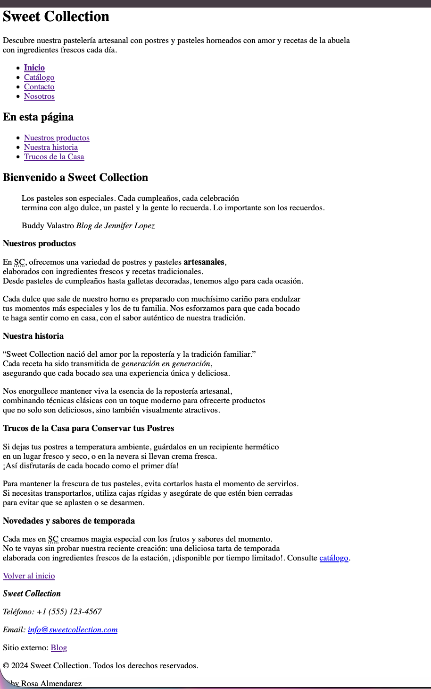

<div align="center" markdown="1">>

# 📘 Portafolio de Evidencias

### Rosa Almendarez Bárcenas

**CSTI12002 · Codificación de páginas web** · Instituto Nacional de Aprendizaje
Facilitador: Giovanni Antonio Coto Calderón · Edición 2 · 2026


</div>

---

## 📖 Sobre este portafolio

Este repositorio reúne el trabajo realizado durante las 150 horas del módulo
**Codificación de páginas web**. Cada carpeta corresponde a una unidad de aprendizaje
y contiene las prácticas de sus sesiones. El registro de evidencias, más abajo,
documenta sesión por sesión qué se hizo y qué se aprendió.

> Recorrido sugerido: empezar por el registro de evidencias y abrir los enlaces
> de las sesiones que interesen. La galería de capturas muestra los resultados
> más representativos.

---

## 📁 Estructura del repositorio

```
Portafolio-Codificación de Páginas Web/
├── README.md               ← este archivo
├── recursos/               ← capturas de pantalla y material de apoyo
├── unidad-01/              ← Control de versiones
├── unidad-02/              ← Etiquetas y atributos HTML
├── unidad-03/              ← Codificación de hojas de estilo
├── unidad-04/              ← Páginas web responsivas
└── unidad-05/              ← Frameworks y librerías
```

---

## 📋 Registro de evidencias

### Unidad 1 · Implementación de control de versiones

| Sesión | Tema | Qué aprendí | Trabajo | Captura |

| :----: | :----------- | :-------------------------------------------------------------------------------------------------- | :---------------: | :--------------: |

| S01 | Git y GitHub | Inicialización de repositorios locales mediante Git -Conexión del repositorio local con GitHub,repositorio remoto -Configuración inicial para el control de versiones -Establecimiento de buenas prácticas de commits para el desarrollo web | [ver](unidad-01-control-versiones/1.Guia_GitHub_Interfaz_Herramientas.pdf)<br>[ver](unidad-01-control-versiones/2.DESARROLLO-MarcoTeorico-Sesion1-2.pdf)<br>[ver](unidad-01-control-versiones/2.Tarjeta_Bolsillo_Git_GitHub.pdf)<br>[ver](unidad-01-control-versiones/MarcoTeoricoS2-2.pdf) | [ver](recursos/S.01-Evidencia-Estructura-Portafolio.png)

<details markdown="1">
<summary><b>Unidad 2 · Etiquetas y atributos HTML</b> (sesiones 2 a 8)</summary>

| Sesión | Tema |Qué aprendí | Trabajo | Captura |
| :----: | :------------------------- | :--------------------------------------------------------------------------------------------------------------------------------------------- | :---------------: | :--------------: |
| S02 |Git colaborativo, la web y XML | Aprendi sobre comandos git para trabajo colaborativo | [ver](recursos/S.02.Trabajo-colaborativo1.png) | [ver](recursos/S.02.Evidencia-colaborativo1.png) |
| S03 |Estructura del documento HTML5 |Trabajamos en grupo en creacion de páginas en formato HTML y trabajo colaborativo en GitHub| [ver](recursos/S.03.Trabajo_colaborativo2.png) | [ver](recursos/S.03EvidenciaColaborativo02.png) |
| S04 |Texto, enlaces y anclas |Agregamos el Favicon y los metadatosde una pagina personales; profundizamos en la estructura y
organización de documentos HTML mediante la implementación de etiquetas semánticas, mejorando la accesibilidad y el orden lógico del sitio.
Asimismo, integramos enlaces de tipo ancla para optimizar la navegación interna dentro de la misma página | [ver](unidad-02-html/sitio-demo/articulo.html/) | [ver](recursos/S.4.Enlaces-tipo-anclas1.png)<br>[ver](recursos/S.4.Enlaces-tipo-anclas2.png)<br>[ver](recursos/S.4.Enlaces-tipo-anclas3.png)<br>[ver](recursos/S.4.Texto_Semantico_citas.png) |
| S05 | Listas y tablas | Crear listas ordenadas, desordenadas y de descripciones, a colocar una lista dentro de otra para organizarla mejor, y a diseñar tablas uniendo varias celdas para presentar información ordenada.| [ver](unidad-02-html/sitio-demo/horarios.html) | [ver](unidad-02-html/sitio-demo/recursos/S05_ListasyTablas.png) |
| S06 | Formularios y semántica | Aprendí a crear formularios interactivos para recopilar información de los usuarios y a usar etiquetas con significado claro| [ver](unidad-02-html/sitio-demo/registro.html) | [ver](recursos/S.6.Captura-Evidencia-formulario-semántica.png) |
| S07 | Multimedia |Etiquetas, formatos y portadas, incorporar contenido multimedia como videos con subtítulos en VTT, a optimizar el peso de los archivos gráficos| [ver](unidad-02-html/sitio-demo/galeria.html) | [ver](recursos/S.07.Multimedia.png) |
| S08 | SVG y repaso |Aprendi a realizar pagina de insignia html con estructura y a la vez repasamos conceptos y practicas dada | [ver](unidad-02-html/sitio-demo/insignia.html) | [ver](recursos/S.09-vg-html.png) |

<!--
  ─────────────────────────────────────────────────────────────────────
  DÓNDE PEGAR ESTO

  Dentro del bloque <details> de la Unidad 2 que YA existe,
  DESPUÉS de la tabla de sesiones que ya está completada
  y ANTES de la línea que cierra:  </details>

  No borres nada de lo que ya tienes escrito.
  ─────────────────────────────────────────────────────────────────────
-->

---

### El sitio personal

Proyecto propio construido de forma autónoma.
**Tema del sitio:** _(Pastelería SWEET COLLECTION)_

| Página          | Qué contiene                                                                 | Sesiones aplicadas |                        Ver                         |                 Validación                 |
| :-------------- | :--------------------------------------------------------------------------- | :----------------: | :------------------------------------------------: | :----------------------------------------: |
| `index.html`    | Estructura semántica, metadatos, texto jerarquizado, citas, enlaces y anclas |  S03 · S04 · S05   |  [ver](unidad-02-html/sitio-personal/index.html)   |  [ver](recursos/sp-validacion-index.png)   |
| `listas.html`   | Las tres listas, lista anidada y tabla con celdas combinadas                 |        S05         |  [ver](unidad-02-html/sitio-personal/listas.html)  |  [ver](recursos/sp-validacion-listas.png)  |
| `contacto.html` | Formulario con ocho campos y validación de HTML                              |        S06         | [ver](unidad-02-html/sitio-personal/contacto.html) | [ver](recursos/sp-validacion-contacto.png) |
| `galeria.html`  | Imágenes, audio, video con subtítulos y gráficas SVG                         |     S07 · S08      | [ver](unidad-02-html/sitio-personal/galeria.html)  | [ver](recursos/sp-validacion-galeria.png)  |

**Decisiones que tomé**

| Decisión                      | Qué elegí                   | Por qué                                                                                |
| :---------------------------- | :-------------------------- | :------------------------------------------------------------------------------------- |
| Tema del sitio                | Patelería Artesanal         | Me gustaba el tema y me permitía expresar mi creatividad                               |
| Atributo de la lista ordenada | `type="1"`                  | Permite numerar los elementos de la lista en orden iniciando por el queque mas vendido |
| Formatos de imagen usados     | `webp`                      | HAce que las imágenes carguen más rápido                                               |
| Formas del gráfico SVG        | `circle`, `polygon`, `text` | Permite crear formas y texto en el gráfico                                             |

**Cómo se ve**

<p align="center">
  
</p>

<div align="center" markdown="1">

_Portada del sitio personal al cerrar la Unidad 2._

</div>

**Comprobado en dos navegadores:**
[Chrome](recursos/sp-navegador-chrome.png) · [Firefox](recursos/sp-navegador-safari.png)

</details>

<details markdown="1">
<summary><b>Unidad 3 · Codificación de hojas de estilo</b> (sesiones 11 a 20)</summary>
Introducción a CSS,sintaxis y validación           | [ver](unidad-03-css/sitio-personal/index.html) | [ver](recursos/S11.Introduccion-CSS.png) |
|  S12   | Selectores y pseudo-clases |             | [ver](unidad-03/) | [ver](recursos/) |
|  S13   | Tipografía y color         |             | [ver](unidad-03/) | [ver](recursos/) |
|  S14   | Modelo de cajas            |             | [ver](unidad-03/) | [ver](recursos/) |
|  S15   | Display y posicionamiento  |             | [ver](unidad-03/) | [ver](recursos/) |
|  S16   | Flexbox                    |             | [ver](unidad-03/) | [ver](recursos/) |
|  S17   | CSS Grid                   |             | [ver](unidad-03/) | [ver](recursos/) |
|  S18   | Componentes estilizados    |             | [ver](unidad-03/) | [ver](recursos/) |
|  S19   | Animaciones y filtros      |             | [ver](unidad-03/) | [ver](recursos/) |
|  S20   | SCSS y repaso              |             | [ver](unidad-03/) | [ver](recursos/) |

</details>

<details markdown="1">
<summary><b>Unidad 4 · Páginas web responsivas</b> (sesiones 23 a 28)</summary>

| Sesión | Tema                            | Qué aprendí |      Trabajo      |     Captura      |
| :----: | :------------------------------ | :---------- | :---------------: | :--------------: |
|  S23   | Viewport y anchos fluidos       |             | [ver](unidad-04/) | [ver](recursos/) |
|  S24   | Media queries y mobile-first    |             | [ver](unidad-04/) | [ver](recursos/) |
|  S25   | Menú responsivo e impresión     |             | [ver](unidad-04/) | [ver](recursos/) |
|  S26   | Imágenes y video adaptativos    |             | [ver](unidad-04/) | [ver](recursos/) |
|  S27   | Patrones de diseño adaptativo I |             | [ver](unidad-04/) | [ver](recursos/) |
|  S28   | Patrones II y repaso            |             | [ver](unidad-04/) | [ver](recursos/) |

</details>

<details markdown="1">
<summary><b>Unidad 5 · Frameworks y librerías</b> (sesiones 31 a 36)</summary>

| Sesión | Tema                          | Qué aprendí |      Trabajo      |     Captura      |
| :----: | :---------------------------- | :---------- | :---------------: | :--------------: |
|  S31   | Librerías y frameworks        |             | [ver](unidad-05/) | [ver](recursos/) |
|  S32   | Sistema de rejilla I          |             | [ver](unidad-05/) | [ver](recursos/) |
|  S33   | Sistema de rejilla II         |             | [ver](unidad-05/) | [ver](recursos/) |
|  S34   | Tipografía y utilidades       |             | [ver](unidad-05/) | [ver](recursos/) |
|  S35   | Formularios y navegación      |             | [ver](unidad-05/) | [ver](recursos/) |
|  S36   | Componentes y personalización |             | [ver](unidad-05/) | [ver](recursos/) |

</details>

---

## 🖼 Galería de capturas

_(Sustituir por las capturas propias. Se recomienda incluir de tres a seis
imágenes representativas de todo el módulo.)_

<p align="center">
  
</p>

<div align="center" markdown="1">><i>El sitio personal al cierre de la Unidad 3.</i></div>

### El mismo sitio en dos anchos

|                             Móvil (375 px)                              |                               Escritorio (1280 px)                                |
| :---------------------------------------------------------------------: | :-------------------------------------------------------------------------------: |
|  |  |

---

## 🎨 Decisiones técnicas documentadas

_(Completar conforme avanza el módulo. Ejemplos de lo que corresponde anotar aquí.)_

| Decisión                       | Qué elegí | Por qué |
| :----------------------------- | :-------- | :------ |
| Puntos de quiebre              |           |         |
| Patrones de diseño adaptativo  |           |         |
| Método de enlace del framework |           |         |

---

## 💭 Reflexión final

_(Escribir al cerrar el módulo. Tres preguntas para orientarla:)_

1. ¿Qué sé hacer hoy que no sabía el primer día?
2. Comparando mi sitio hecho a mano con el que construí con framework:
   ¿qué fue más rápido, qué quedó más bajo mi control y cuándo usaría cada enfoque?
3. ¿Qué me propongo seguir aprendiendo por mi cuenta?

---

## 🛠 Herramientas empleadas

- **Editor:** Visual Studio Code con Live Server y Prettier
- **Control de versiones:** Git y GitHub
- **Lenguajes:** HTML5, CSS3, XML, SVG
- **Framework:** Bootstrap 5 y Bootstrap Icons
- **Validadores:** W3C Markup Validation Service y CSS Jigsaw
- **Preprocesador:** SCSS/Sass

---

<div align="center" markdown="1">>

**Rosa.Almendarez** · rosa.almendarez09@gmail.com

Portafolio elaborado durante el módulo CSTI12002 · Instituto Nacional de Aprendizaje · 2026

</div>
